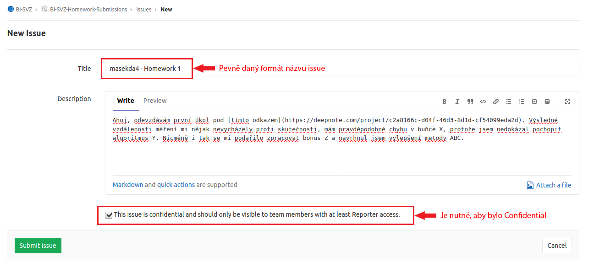

= 3. Domácí úkoly

V semestru budou postupně zadány celkem *4 jednoduché domácí úkoly*. Úkoly zadáváme, abychom ověřili vaše pochopení probírané látky. Pro všechny, kteří porozumí látce probrané na cvičení, se jedná maximálně o dvou hodinovou záležitost. Úkoly volně *navazují na úlohy z cvičení*.

Úkoly nejsou povinné, *tvoří však přes polovinu možných bodů ze semestru* (26 bodů z celkových 50). Připomínáme, že k získání zápočtu je nutné za cvičení získat *minimálně 25 bodů*, podrobnosti viz sekce xref:../classification/index#[Hodnocení].

Na začátku každého cvičení bude prostor na dotazy týkající se aktuálního zadaného úkolu. Cílem je vyřešit problémy a nejasnosti.

Může se stát, že v rámci úkolu budete řešit nějaký technický problém - např. nefunguje knihovna, nevyřešitelná chyba, nefungující  prostředí, nemáte data, apod. Ideální by tedy bylo tyto věci *zkontrolovat dříve než den před odevzdáním*. Jinak nebude v naší moci vám s vyřešením problému pomoct.

== Potřebné nástroje k úkolům

Úkoly budou ve stejném formátu jako probíhá práce na cvičení, tzn. implementace kódu v prostředí Jupyter Notebook. K tomu, abyste nemuseli rozcházet Python prostředí na svém vlastním počítači, využijeme online nástroj xref:../manuals/deepnote-introduction#[𝔻 Deepnote].

Kromě toho bude v nějakých úlohách nutné využívat služby Google Cloudu. Podrobnosti k tomuto postupu naleznete xref:../manuals/google-cloud#[zde].

== Náležitosti úkolu

Počítejte prosím s tím, že úkol po vás bude někdo číst. Buďte tedy tak hodní a kód udržujte čistý a čitelný. Podrobnou dokumentaci nevyžadujeme, avšak každá složitější buňka nebo funkce musí  mít svůj komentář. Ať je vždy jasné, co daný segment dělá a co je výstupem. Pokud nebude kód srozumitelný a okomentovaný, nebude v našich silách k němu poskytnout zpětnou vazbu a v extrémních případech může být i nehodnotitelný.

== Odevzdání úkolů

Úkoly se odevzdávají na *FIT GitLab*, konkrétně do veřejného repozitáře https://gitlab.fit.cvut.cz/bi-svz/bi-svz-homework-submissions[BI-SVZ-Homework-Submissions].

Pro každý úkol v daném repozitáři vytvořte tzv. *Confidential issue* (viz screen níže). Díky označení flagem *Confidential* nebudou detaily diskutované mezi vámi a cvičícími viditelné pro kohokoliv jiného.

Do každého issue *vložte odkaz* na vypracovaný úkol v nástroji Deepnote a zkontrolujte si, že do odevzdávaného projektu mají *všichni cvičící* přístup. Kromě toho můžete v popisu ještě uvést jakékoliv jiné detaily, které by nám měly pomoct v hodnocení. Každý odevzdaný úkol vhodně pojmenujte a to ve formátu: ``__username__ - Homework __číslo-úkolu__``.

== Etika domácích úkolů

Tak jako je u nás na fakultě zvykem, úkoly je *nutno vypracovávat samostatně.* Plagiátorství nebude tolerováno. V případě *podezření* bude automaticky úkol ohodnocen 0 body. Záleží pak pouze na studentovi, zda se to změní.

Pokud budete využívat části kódů z internetových zdrojů (např. StackOverflow), *uvádějte v kódu odkaz na zdrojové vlákno*. Dále *převzatý kód okomentujte,* ať je vidět, že dané problematice rozumíte.

Pokud bude úkol odevzdán po deadlinu, ten je zpravidla před půlnocí daný den, bude ohodnocen 0 body.

== Harmonogram úkolů

Harmonogram úkolů je předběžný. V průběhu semestru může být upravován.

// Definice proměnných datumů
include::../vars.adoc[]

.Harmonogram úkolů
[cols="2,3,3,9,^2", options="header"]
|===
| Úkol | Zadání     | Deadline   | Téma     | Body
| 1.   | {hw1_from} | {hw1_to} | 𝔻{nbsp}
link:https://deepnote.com/project/Homework-1-yeMyOhQ-TJ6O8cbtkGLlPA[
Měření nejkratší vzdálenosti obdélníků
]
| 5 (+2)
| 2.   | {hw2_from} | {hw2_to}  | 𝔻{nbsp}
//link:https://deepnote.com/project/0027bb59-6ec3-4a0d-bae5-5343fe353469[
Projektivní transformace
//]
| 6 (+2)
| 3.   | {hw3_from}  | {hw3_to} | 𝔻{nbsp}
//link:https://deepnote.com/project/dd8fd64a-73b5-45e5-8bd2-9e8e3887d224[
Výpočet BMI s využitím dat hloubkového senzoru
//]
| 7 (+2)
| 4.   | {hw4_from} | {hw4_to}   | 𝔻{nbsp}
//link:https://deepnote.com/project/cb96ed8f-8ccb-4e75-aa03-5c9798c13a08[
Výpočet plochy zahřívaného spoje s využitím dat termokamery a RGB kamery
//]
| 8 (+2)
|===
