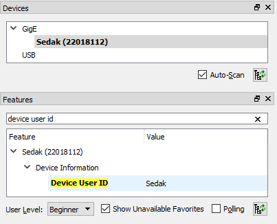

= Seznámení s nástroji pro kurz BI-SVZ

Pro práci na cvičení a později i na domácích úkolech budeme využívat několik nástrojů. 

* https://www.anaconda.com/[Anaconda] - multiplatformní správce balíčků pro jazyk Python.
* http://jupyter.org/[Jupyter notebook] - webová aplikace k rychlému prototypování algoritmů v Pythonu.
* Impro - "krabičková" platforma s algoritmy a rozhraními pro různé druhy kamer.
* https://www.baslerweb.com/en/products/software/basler-pylon-camera-software-suite/[Pylon] - software a SDK sloužící pro práci s kamerami od firmy Basler. 
  
Volba jazyka Python může být pro některé z vás nepochopitelná, zvláště když v bakalářském programu není povinný. Důvod je však prostý - jazyk Python je v tuto chvíli nejvyužívanější pro obory data science a computer vision. Vývoj v Pythonu je rychlý, jednoduchý a velmi efektivní. Existuje velké množství knihoven, návodů a připravených kódů, které v ostatních jazycích nemají obdoby. Navíc, pokud byste se chtěli zpracování obrazu dále věnovat, stejně byste pravděpodobně skončili právě s Pythonem. Ti z vás, kteří budou pokračovat v magisterském programu Znalostního inženýrství, si Pythonem a Jupyter notebooky hojně užijí i později.

Cílem tohoto kurzu však není vyučovat jazyk Python, nýbrž zaměřit se právě na klíčové metody a algoritmy zpracování obrazu. Python je jen nejvhodnější nástroj, jak tento cíl bezbolestně naplnit a zároveň toho ukázat co nejvíce. 

Naše práce se nebude skládat ani tak z programování v Pythonu, ale převážně z volání již hotových metod a využívání rozhraní (např. OpenCV). Uvidíte sami, že většina úkolů, které budeme řešit, budou velmi předpřipravené a vystačíme si tedy se základní syntaxí jazyka. Mnohem důležitější je porozumění kontextu problému a návrh algoritmů/metod k jeho vyřešení.

Stručné základy Pythonu lze nalézt v notebooku [python-introduction.ipynb](python-introduction.ipynb). Pro hlubší poznání pak třeba kurz v češtině od https://naucse.python.cz/course/pyladies/[PyLadies]
Často využívané klávesové zkratky v Jupyter notebooku jsou popsány link:(../jupyter-notebook-cheat-sheet.pdf)[ZDE].

== Rozchození virtuálního prostředí pro práci v Pythonu s Jupyter Notebooky

V učebně máme nainstalovaný systém Windows, všechny popsané kroky se tedy budou týkat tohoto systému. Instalace a kroky na Linuxu však probíhájí obdobně. 

K naší práci budeme potřebovat několik balíčku, které je potřeba nainstalovat do virtuálního prostředí. Abychom nám usnadnily život, je možné při vytváření virtuálního prostředí specifikovat soubor link:(spec-file.txt)[spec-file.txt] (pozor funguje jen pro systémy Win x64), který obsahuje seznam potřebných balíčků pro tento kurz. Ty se následně nainstalují při vytváření virtuálního prostředí. 

Detaily ke správě prostředí lze nalézt https://conda.io/docs/user-guide/tasks/manage-environments.html[zde], detaily k instalaci balíčků https://conda.io/docs/user-guide/tasks/manage-pkgs.html[zde].

=== Postup

* Zkontrolujte, zda je u vás na PC nainstalovaná Anaconda. Jinak si ji https://www.anaconda.com/download[stáhněte] a nainstalujte (vždy nejnovější verzi pro Python 3.6).
* Zapněte si `Anaconda Prompt`, ve kterém je možné využívat Python interpreter, instalovat balíčky a přepínat/modifikovat virtuální prostředí.
* Zkontrolujte, jaké u vás existují virtuální prostředí 
** `conda env list`
* Pokud v seznamu *NENÍ* prostředí SVZ a:
** nacházíte se u PC v Improlabu
*** Přidejte cestu s vytvořeným virtuální prostředí do Anacondy. 
**** `conda config --append envs_dirs D:\env`
*** Vyzkoušejte:
**** `conda activate SVZ`
** jste na domácím PC 
*** Jestliže máte systém Win x64, zkuste vytvořit prostředí SVZ pomocí link:(spec-file.txt)[spec-file.txt] takto:
**** `conda create --n SVZ --file <cesta k spec-file.txt>`
*** Jinak vytvořte prostředí a aktivujte jej:
**** `conda create -n SVZ`
**** `conda activate SVZ`
*** A doinstalujte potřebné balíčky  (např. numpy a scipy):
**** `conda install numpy scipy`
* Pokud stále něco nepůjde, kontaktujte učitele :)

=== Důležité

* Před každým cvičením/úkolem je nutné zkontrolovat zda nepracujete ve výchozím prostředí (base). Přepnutí do prostředí SVZ:
** `conda activate SVZ`
* S aktivovaným prostředím spusťte Jupyter notebook ve složce se soubory ke kurzu
** `jupyter notebook <cesta k souborum kurzu>` 
* Otevřete úvodní notebook link:(python-introduction.ipynb)[Seznámení s jazykem Python] a zkontrolujte, zda všechny úvodní importy proběhnou bez problémů. Pokud uvidíte hlášky typu `ImportError: No module named cv2`, musíte daný balíček doinstalovat pomocí `conda install`.

==== Poznámky

Výpis všech virtuálních prostředí lze provést pomocí `conda env list`, výpis balíčku v aktuálním prostředí `conda list`. Deaktivace aktuálního prostředí pomocí `conda deactivate`.  V případě, že chcete nějaké prostředí odstranit, tak `conda env remove --name <nazev>`. Dobrým zvykem je neinstalovat balíčky globálně (do výchozího base prostředí), ale pro každý projekt vytvořit nové virtuální prostředí. Další detaily ke správě prostředí lze nalézt https://conda.io/docs/user-guide/tasks/manage-environments.html[zde].

==== Tvorba nového virtuálního prostředí (pro admina) 

* Stáhnout soubor link:(spec-file.txt)[spec-file.txt] a vytvořit virtuální prostředí s balíčky nutnými pro tento kurz. 
* Virtuální prostředí se vytváří na disku D:
** `conda create --prefix D:\env\SVZ --file <cesta k spec-file.txt>`

== Přípojení a správa kamer v Pylonu 

Pylon Viewer je software, SDK a zároveň i soubor ovladačů pro připojení a práci s průmyslovými kamerami Basler. Oficiální manuál je k dispozici https://docs.baslerweb.com/=t=en%2Fpylon_camera_software_suite.htm%23bc-1&rhtocid=_3_0[ZDE]. 

=== Základ

Základem je najít tu správnou kameru v menu dostupných. Vzhledem k tomu, že všechny GigE kamery jsou připojeny na stejný switch, má každé pracoviště dostupné všechny kamery. 

*DŮLEŽITÉ*: Ve chvíli, kdy je některá kamera otevřena v jakémkoli softwaru na jakémkoli počítači, je v tu chvíli zamknuta k danému softwaru. Nelze se k ní již připojit z jiného softwaru. Proto je vždy třeba vědět, jaké je sériové číslo kamery, která je dostupná pro vaše pracoviště a k té se připojovat.

Sériové číslo kamery je napsáno přímo na kameře (první obrázek) nebo přímo na krabici kamery (druhý obrázek).

image:images/kam_SN.png[]

Pro jednodušší vyhledání kamery lze kameře v Pylonu nastavit tzv. Device User ID. Jedná se o neunikátní identifikátor, který se bude v Pylonu zobrazovat jako název kamery před jejím sériovým číslem (v závorce). Pro projevení změny po nastavení je potřeba software Pylon vypnout a zapnout.

=== Několik užitečných odkazů

* https://docs.baslerweb.com/=t=en%2Foverview_of_the_pylon_viewer.htm%23bc*1&rhtocid=_3_0_0_0[Přehled softwaru Pylon]
** Obsahuje popis všech ikon z menu a hlavně z toolbaru.
* https://docs.baslerweb.com/=t=en%2Fopening_and_closing_a_camera.htm[Připojení kamery]
** Prakticky se jedná pouze o klik na požadovanou ikonu z toolbaru.
* https://docs.baslerweb.com/=t=en%2Fconfiguring_a_camera.htm[Základní konfigurace kamery]
** Ukazuje rychlý postup, jak nastavit pár základních parametrů kamery, jakými jsou Zisk (Gain) nebo Expoziční čas (Exposure Time).

=== Nastavení parametrů kamery
Názvy často hledaných parametrů jsou:

* Gain, Gain Auto
* Exposure Time, Exposure Auto
* Pixel Format
* Width, Height, X Offset, Y Offset
* Binning Horizontal, Binning Vertical
** pouze pro černobílé kamery!
* Acquisition Frame Rate, Enable Acquisition Frame Rate

Nejjednodušší způsob je využít pole hledání. 

image:images/animation_setting_parameters.gif[]
