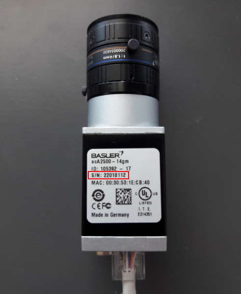
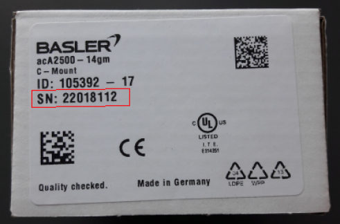

# Seznámení s nástroji pro kurz BI-SVZ
Pro práci na cvičením a později i na domácích úkolech budeme využívat několik nástrojů. 
* [Anaconda](https://www.anaconda.com/) - multiplatformní správce balíčků pro jazyk Python.
* [Jupyter notebook](http://jupyter.org/) - webová aplikace k rychlému prototypování algoritmů v Pythonu.
* Impro- "krabičková" platforma s algoritmy a rozhraními pro různé druhy kamer.
* [Pylon](https://www.baslerweb.com/en/products/software/basler-pylon-camera-software-suite/) - software sloužící pro práci s kamerami od firmy Basler. 
  
Volba jazyka Python může být pro některé z vás nepochopitelná, zvláště když v bakalářském programu není povinný. Důvod je však prostý. Jazyk Python je v tuto chvíli nejvyužívanější pro obory data science a computer vision. Vývoj v Pythonu je rychlý, jednoduchý a velmi efektivní. Existuje velké množství knihoven, návodů a připravených kódů, které v ostatních jazycích nemají obdoby. Navíc, pokud byste se chtěli zpracování obrazu dále věnovat, stejně byste pravděpodobně skončili právě s Pythonem. Ti z vás, kteří budou pokračovat v magisterském programu Znalostního inženýrství si Pythonem s Jupyter notebooky hojně užijí i později.
​    
Cílem tohoto kurzu však není vyučovat jazyk Python, nýbrž zaměřit se právě na samotné metody a algoritmy zpracování obrazu. Python je jen snadná cesta, jak toho snadno ukázat co nejvíc. Naše práce se nebude skládat ani tak z programování v Pythonu, ale převážně z volání již hotových metod a využívání rozhraní (např. OpenCV). Uvidíte sami, že většina úkolů, které budeme řešit, budou velmi předpřipravené a vystačíme si tedy s doplněním pouze několika řádek základního kódu. Mnohem důležitější je porozumění problému a návrh algoritmů/metod k jeho vyřešení.

Stručné základy Pythonu lze nalézt v notebooku [python-introduction.ipynb](python-introduction.ipynb). Pro hlubší poznání pak třeba kurz v češtině od [PyLadies](https://naucse.python.cz/course/pyladies/)
Často využívané klávesové zkratky v Jupyter notebooku jsou popsány [zde](../jupyter-notebook-cheat-sheet.pdf).

## Rozchození virtuálního prostředí pro práci v Pythonu s Jupyter Notebooky

V učebně máme nainstalovaný systém Windows, všechny popsané kroky se tedy budou týkat tohoto systému. Instalace a kroky na Linuxu však probíhájí obdobně. 
K naší práci budeme potřebovat několik balíčku, které je potřeba nainstalovat do virtuálního prostředí. Abychom vám usnadnily život, je možné při vytváření virtuálního prostředí specifikovat soubor [spec-file.txt](spec-file.txt) (pozor funguje jen pro Win x64), který obsahuje seznam potřebných balíčků pro tento kurz. Ty se následně nainstalují. 

### Postup
* Zkontrolujte, zda je u vás na PC nainstalovaná Anaconda. Jinak si ji [stáhněte](https://www.anaconda.com/download)  a nainstalujte (pro Python 3.6).
* Zapněte si Anaconda Prompt, ve kterém je možné využívat Python interpreter, instalovat balíčky a přepínat/modifikovat virtuální prostředí.
<<<<<<< HEAD
* Stáhněte soubor  [spec-file.txt](spec-file.txt) a vytvořte virtuální prostředí s balíčky nutnými pro tento kurz. Virtuální prostředí si vytvořte na svém síťovém disku H:. 
	* `conda create --prefix H:\env\SVZ --file <cesta k spec-file.txt>`
* Přidejte cestu s vytvořeným virtuální prostředí do Anacondy. 
  * `conda config --append envs_dirs H:\env`
* Před každým úkolem je nutné zkontrolovat zda nepracujete ve výchozím prostředí (base). Přepnutí do prostředí SVZ:
	* `conda activate SVZ`
	* S aktivovaným prostředím spusťte Jupyter notebook ve složce se soubory ke kurzu
		* `jupyter notebook <cesta k souborum kurzu>` 
*  Otevřete úvodní [python-introduction](python-introduction.ipynb) notebook a zkontrolujte, zda všechny úvodní importy proběhnou bez problému.

Výpis všech virtuálních prostředí lze provést pomocí `conda env list`, výpis balíčku v aktuálním prostředí `conda list`. Deaktivace aktuálního prostředí pomocí `conda deactivate`.  V případě, že chcete nějaké prostředí odstranit, tak `conda env remove --name <nazev>`. Dobrým zvykem je neinstalovat balíčky globálně (do výchozího base prostředí), ale pro každý projekt vytvořit nové virtuální prostředí. Další detaily ke správě prostředí lze nalézt [zde](https://conda.io/docs/user-guide/tasks/manage-environments.html).

=======
* Zkontrolujte, jaké existují virtuální prostředí 
  * `conda env list`
* Pokud v seznamu **NENÍ** SVZ:
  * Přidejte cestu s vytvořeným virtuální prostředí do Anacondy. 
    - `conda config --append envs_dirs D:\env`
  * Vyzkoušejte:
    * `conda activate SVZ`
* Pokud stále něco nepůjde, kontaktujte učitele :)

### Důležité

* Před každým úkolem je nutné zkontrolovat zda nepracujete ve výchozím prostředí (base). Přepnutí do prostředí SVZ:
  * `conda activate SVZ`
  * S aktivovaným prostředím spusťte Jupyter notebook ve složce se soubory ke kurzu
  	* `jupyter notebook <cesta k souborum kurzu>` 
* Otevřete úvodní [python-introduction](python-introduction.ipynb) notebook a zkontrolujte, zda všechny úvodní importy proběhnou bez problému.

#### Poznámky

Výpis všech virtuálních prostředí lze provést pomocí `conda env list`, výpis balíčku v aktuálním prostředí `conda list`. Deaktivace aktuálního prostředí pomocí `conda deactivate`.  V případě, že chcete nějaké prostředí odstranit, tak `conda env remove --name <nazev>`. Dobrým zvykem je neinstalovat balíčky globálně (do výchozího base prostředí), ale pro každý projekt vytvořit nové virtuální prostředí. Další detaily ke správě prostředí lze nalézt [zde](https://conda.io/docs/user-guide/tasks/manage-environments.html).

#### Tvorba nového virtuálního prostředí (pro admina) 

- Stáhnout soubor [spec-file.txt](spec-file.txt) a vytvořit virtuální prostředí s balíčky nutnými pro tento kurz. 
  - Virtuální prostředí se vytváří na disku D:
  - `conda create --prefix D:\env\SVZ --file <cesta k spec-file.txt>`

>>>>>>> 51a357aec4c84112637dfbfd08fc7a591d7e493e

## Přípojení a správa kamer v Pylonu 
Pylon Viewer je software, SDK a zároveň i soubor ovladačů pro připojení a práci s průmyslovými kamerami Basler. Oficiální manuál je k dispozici [ZDE](https://docs.baslerweb.com/#t=en%2Fpylon_camera_software_suite.htm%23bc-1&rhtocid=_3_0). 

### Základ
Základem je najít tu správnou kameru v menu dostupných. Vzhledem k tomu, že všechny GigE kamery jsou připojeny na stejný switch, má každé pracoviště dostupné všechny kamery. 

**DŮLEŽITÉ**: Ve chvíli, kdy je některá kamera otevřena v jakémkoli softwaru na jakémkoli počítači, je v tu chvíli zamknuta k danému softwaru. Nelze se k ní již připojit z jiného softwaru. Proto je vždy třeba vědět, jaké je sériové číslo kamery, která je dostupná pro vaše pracoviště a k té se připojovat.

Sériové číslo kamery je napsáno přímo na kameře (první obrázek) nebo přímo na krabici kamery (druhý obrázek).

Pro jednodušší vyhledání kamery lze kameře v Pylonu nastavit tzv. Device User ID. Jedná se o neunikátní identifikátor, který se bude v Pylonu zobrazovat jako název kamery před jejím sériovým číslem (v závorce). Pro projevení změny po nastavení je potřeba software Pylon vypnout a zapnout.

### Několik užitečných odkazů
- [Přehled softwaru Pylon](https://docs.baslerweb.com/#t=en%2Foverview_of_the_pylon_viewer.htm%23bc-1&rhtocid=_3_0_0_0)
  - Obsahuje popis všech ikon z menu a hlavně z toolbaru.
- [Připojení kamery](https://docs.baslerweb.com/#t=en%2Fopening_and_closing_a_camera.htm)
  - Prakticky se jedná pouze o klik na požadovanou ikonu z toolbaru.
- [Základní konfigurace kamery](https://docs.baslerweb.com/#t=en%2Fconfiguring_a_camera.htm)
  - Ukazuje rychlý postup, jak nastavit pár základních parametrů kamery, jakými jsou Zisk (Gain) nebo Expoziční čas (Exposure Time).

### Nastavení parametrů kamery
Názvy často hledaných parametrů jsou:

- Gain, Gain Auto
- Exposure Time, Exposure Auto
- Pixel Format
- Width, Height, X Offset, Y Offset
- Binning Horizontal, Binning Vertical
  - pouze pro černobílé kamery!
- Acquisition Frame Rate, Enable Acquisition Frame Rate

Nejjednodušší způsob je využít pole hledání. 

