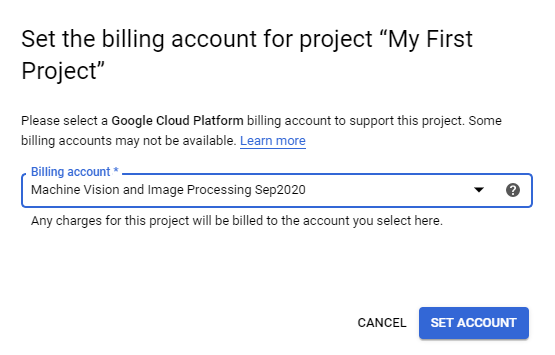

= Postup rozchození Google Cloudu

V rámci našeho kurzu se vám snažíme předat co nejšiřší přehled v praxi využívaných postupů a nástrojů pro práci s obrazem. Jedním z takových nástrojů je populární služba https://cloud.google.com/vision[Google Cloud Vision], které se snaží zjednodušit přístup k algoritmům strojového a počítačového vidění. Přednostmi této služby jsou:

* Detekce více objektů ze snímku pomocí předtrénovaných modelů.
* Detekce textu bez nutnosti složitého předzpracování.
* Detekce obličejů a emocí.
* Generování slovních popisů k obrázkům.
* Hledání podobných snímků.
* Snadné trénování ML modelu pro vlastní třídy pomocí AutoML.

Jednou z hlavních výhod této služby je, že veškerá vyhodnocení probíhají na serverech Googlu a existují tedy minimální požadavky na lokální HW. Uživatel tedy pouze nahrává svá data, volá API rozhraní a dostává výsledky. Další výhodou je také to, že využívání této služby je do jisté míry zdarma (neplatí pro AutoML a je omezeno počtem API callů).

V našem kurzu se s Google Cloudem seznámíme během drůhého domácího úkolu. A to konkrétně s Vision a Translation API. Pro snadný onboarding do tohoto nástroje, jsme si pro vás připravili krátký návod.

== Úvod
Ačkoliv platí, že většina služeb z Vision API je zdarma, je i přesto nutné mít v Google Cloudu svou registraci. Pro to, abyste v Google Cloudu nemuseli spouštět 3 měsíční trial, který vyžaduje zadání informací o kreditní kartě, je v rámci BI-SVZ dostupný Educational Grant – kupón $50 pro každého studenta tohoto předmětu. Během kurzu by se vám nemělo podařit utratit ani dolar, tudíž můžete kredity volně použít na cokoliv, co se vám bude líbit.  

== Registrace do Google Cloudu
Cvičící by vám skrze MS Teams měli poslat odkaz, který slouží ke claimování výše diskutovaného kupónu.

Claimnutí kupónu je snadný proces. Stačí vyplnit své jméno a školní email končící na @fit.cvut.cz. Po odeslání formuláře vám dorazí email s aktivačním odkazem, který potvrďte. Na základě toho vám pak dorazí ještě jeden email, ve kterém uvidíte kód kupónu a odkaz **Click here to reedem**. Po kliknutí na reedem je nutné se přihlásit. 

**Důležité**: přihlašte se svým fakultním účtem (username@fit.cvut.cz), ať nemícháté své soukromé projekty a billing se školními. 

Následně jen potvrdíte souhlas s podmínkami a vašemu účtu bude přidělen $50 kupón (lze nalézt v Billing sekci). Tím postup registrace a získání kreditů končí. 

**Důležité**: nezapomeňte, že kredity můžete využít i na své vlastní projekty. V BI-SVZ  vystačíme s free limity, takže těch $50 zůstane nevyužito a časem vyexpirují.

== Aktivace Cloud Vision API
Otevřete si https://console.cloud.google.com/marketplace/product/google/vision.googleapis.com[odkaz] k aktivaci Cloud Vision API a zkontrolute, zda jste přihlášení pod školním účtem (resp. tím, kde jste claimovali kredity).

K aktivaci jakékoliv služby Google Cloudu je vždy nutné mít vytvořený nějaký projekt. 

* Pokud Google Cloud využíváte poprvé, tak se vám v sekci Cloud Vision API po kliknutí na tlačítko *ENABLE* automaticky vytvoří výchozí projekt. 
* Pokud jste již se službou někdy dříve pracovali, tak po kliku na *ENABLE* dostanete na výběr ze seznamu existujících projektů. V tomto případě doporučujeme pod tímto https://console.cloud.google.com/projectcreate[odkazem] vytvořit samostatný projekt BI-SVZ pod organizací _fit.cvut.cz_ ať v tom není nepořádek.

Po úspěšné aktivaci služby Vision je nutné vygenerovat přístupový API klíč. Pokud opět používáte službu poprvé, mělo by se vám po aktivaci na přehledu zobrazit tlačítko *CREATE CREDENTIALS*. V případě, že tomu tak není, využijte tento https://console.cloud.google.com/apis/credentials[odkaz].

Vytvořte tedy nový Service account, který vhodně pojmenujte a nastavte mu práva na Owner. Po odeslání formuláře dojde ke stažení JSON klíče, *který si pečlivě uschovejte*. V případě, jeho ztráty jej nejde znovu stáhnout, ale je nutné vytvořit nový Service account.

== Aktivace Cloud Translation API

Otevřete si https://console.cloud.google.com/marketplace/product/google/translate.googleapis.com[odkaz] k aktivaci Cloud Translation API a zkontrolute, zda jste přihlášení pod školním účtem (resp. tím, kde jste claimovali kredity).

Stejně jako v předchozím případě pokračujte stiskem *ENABLE*, kde mohou opět nastat dvě různé situace v závislosti na (ne)existenci projektu. Pokud jdete cestou nově vytvořeného projektu z předchozího kroku Cloud Vision API, bude  nutné projektu přiřadit Billing account. To spočívá pouze v kliknutí na *ENABLE BILLING* a výběru Billing účtu, který vznikl claimnutím $50 kupónu, k cílovému projektu.

Nyní by mělo být vše řádně nastaveno. Pro Translation API můžete využívat stejný API klíč jako pro Vision.

== Troubleshooting
Postup aktivace kreditů a nastavení služeb je přímočarý, takže by neměly vzniknout žádné potíže. Postup je také zdokumentován přímo v https://cloud.google.com/vision/docs/before-you-begin[oficiální dokumentaci].

Pokud využíváte odkazy uvedené v tomto návodu, může se vám stát, že se vám budou přepínat účty - chcete využívat školní, ale přepíná vám to na soukromý. Řešení tohoto problému jsou možná dvě.

. Využít anonymní okno v prohlížeči a vše nastavit tam.
. Nepoužívat odkazy, ale názvy služeb a nastavení hledat skrze Search bar (alternativně skrze menu).

