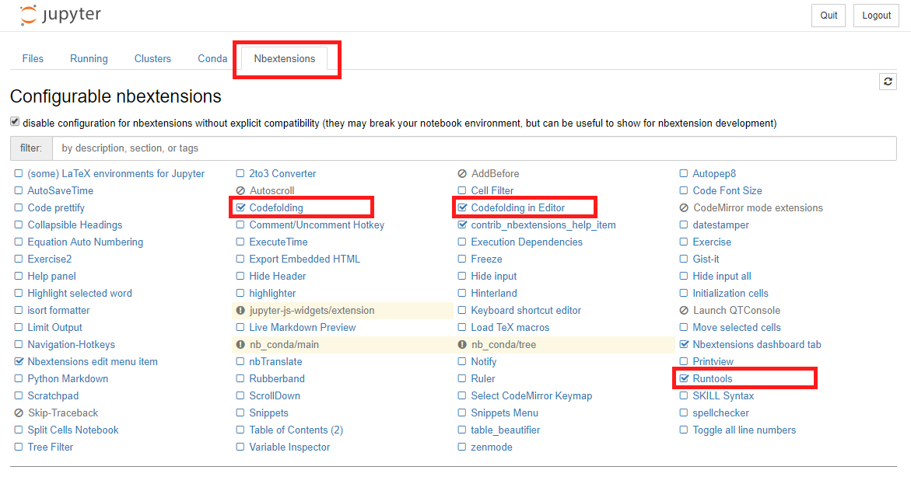

= Cvičení

Změna programu vyhrazena. Cvičení se v průběhu budou měnit / přizpůsobovat letnímu semestru.

.Harmonogram cvičení
[width=100%, cols="^1,2,5,5,^1", options="header"]
|====
| Cvičení | Datum | Téma | Soubory | Body

|   1.    | 22. 2. 2019  | Úvodní cvičení, seznámení s nástroji | 📖{nbsp}link:files/1/bi-svz-01-cviceni-uvod.pdf[Úvod{nbsp}do{nbsp}předmětu],
🔗{nbsp}xref:files/1/course-tools-introduction#[Návod{nbsp}k{nbsp}nástrojům],
📜{nbsp}link:files/1/tools-introduction.ipynb[Úvod{nbsp}do{nbsp}práce{nbsp}s{nbsp}nástroji],
📜{nbsp}link:files/1/python-introduction.ipynb[Úvod{nbsp}do{nbsp}Pythonu]
|  2

|   2.    | 1. 3. 2019 | Práce v Jupyter notebooku        |  📜{nbsp}link:files/2/jupyter-introduction.ipynb[Práce{nbsp}v{nbsp}Jupyter{nbsp}notebook] |  2

|   3.    | 8. 3. 2019 | Vady optiky, kalibrace kamery        | 📜{nbsp}link:files/2/basler-introduction.ipynb[Práce{nbsp}s{nbsp}Basler{nbsp}kamerami],
📜{nbsp}link:files/2/camera-calib.ipynb[Kalibrace{nbsp}kamery],
📚{nbsp}https://github.com/mbalatsko/pypylon-opencv-viewer[Knihovna{nbsp}pro{nbsp}práci{nbsp}s{nbsp}kamerami]|  2

|   4.    | 15. 3. 2019 | Základy segmentace                   | 📜{nbsp}link:files/3/segmentation_and_measuring.ipynb[Základy segmentace] |  2

|   5.    | 22. 3. 2019 | Pokročilejší  techniky segmentace    | 📜{nbsp}link:files/4/segmentation-objects-count.ipynb[Segmentace{nbsp}-{nbsp}počítání{nbsp}objektů],
📜{nbsp}link:files/4/segmentation-fit-ocr.ipynb[Segmentace{nbsp}-{nbsp}OCR{nbsp}textu] |  2

|   6.    | 29. 3. 2019  | Perspektiva obrazu                   | 📜{nbsp}link:files/5/perspective-measuring.ipynb[Perspektiva{nbsp}-{nbsp}měření{nbsp}výšky],
📜{nbsp}link:files/5/perspective-measuring-cont.ipynb[Perspektiva{nbsp}-{nbsp}měření{nbsp}vzdálenosti]  |  2

|   7.    | 5. 4. 2019  | Pespektiva obrazu, 360° objektivy  | 📜{nbsp}link:files/6/perspective-cart-polar-system.ipynb[Perspektiva{nbsp}-{nbsp}polární{nbsp}souřadný{nbsp}systém]    |  2

|   8.    | 12. 4. 2019 | Práce s hloubkovou kamerou           | 📜{nbsp}link:files/7/depth-collisions.ipynb[Hloubkové{nbsp}senzory{nbsp}-{nbsp}detekce{nbsp}kolizí]    |  2

|   9.    | 19. 4. 2019 | Klasifikace obrazu, detekce objektů  | 📜{nbsp}link:files/8/object-classification.ipynb[Klasifikace{nbsp}objektů{nbsp}-{nbsp}tvarové{nbsp}charakteristiky]
💾{nbsp}link:https://github.com/matterport/Mask_RCNN[Mask-RCNN{nbsp}github{nbsp}repozitář{nbsp}]    |  2

|   10.    | 26. 4. 2019 | Základy měření s termokamerou        |   📜{nbsp}link:files/9/face-detection.ipynb[Detekce{nbsp}obličeje{nbsp}pomoci{nbsp}termokamery] |  2

|   11.   | 3. 5. 2019  | Řádkové kamery                       | 📜{nbsp}link:files/10/scratches-detection.ipynb[Detekce{nbsp}škrábanců{nbsp}na{nbsp}skle]    |  2

|   12.   | 10. 5. 2019 | Konzultace k praktické zkoušce              |     |  2
|====

📜{nbsp}Notebook funkcí použitých v SVZ. Bude se postupně zlepšovat s přibývajícími cvičeními.

📄{nbsp}link:files/jupyter-notebook-cheat-sheet.pdf[Jupyter notebook cheatsheet]

== Postup pro přidání rozšíření do jupyteru
Hlavně se jedná o rozšíření Codefolding, Codefolding in Editor a RunTools.

.Spusťte konzoli `Anaconda Prompt` a zadejte:
[source,cmd]
activate SVZ
pip install jupyter_contrib_nbextensions jupyter_nbextensions_configurator
jupyter contrib nbextension install --sys-prefix
jupyter nbextensions_configurator enable --sys-prefix

Následně je třeba rozšíření aktivovat přímo v Jupyter Notebooku.

