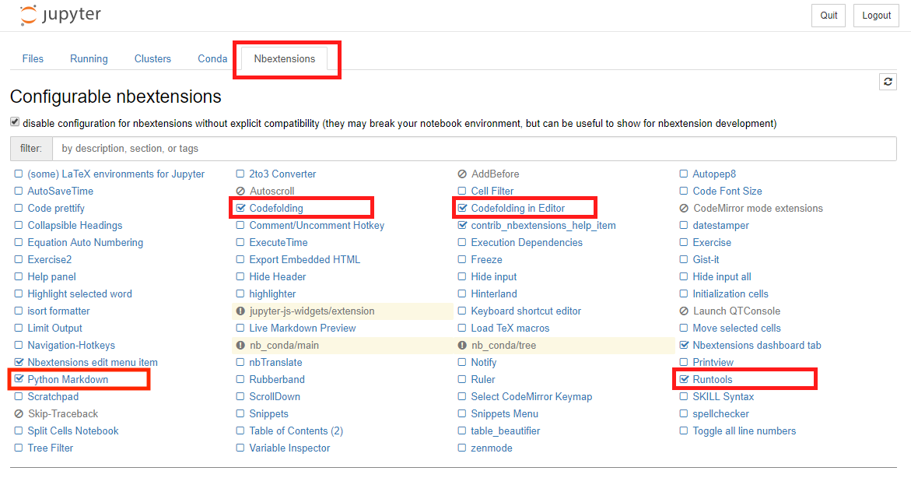

= Rozšíření

I nástroj Jupyter notebook umožňuje přidat různá rozšíření pro zlepšení a zjednodušení práce. Doporučujeme přidat následující rozšíření podle návodu níže.

== Postup pro přidání rozšíření do jupyteru

Jedná se o následující rozšíření:

* Codefolding
* Codefolding in Editor
* RunTools

Rozšíření je třeba aktivovat přímo v Jupyter Notebooku po jeho spuštění.

