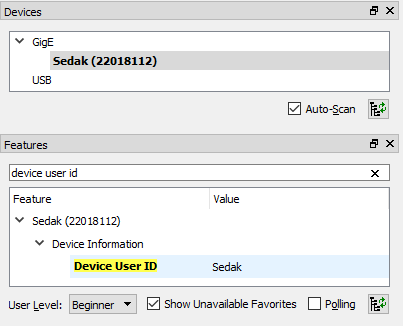

= Přípojení a správa kamer v Pylonu 

Pylon Viewer je software, SDK a zároveň i soubor ovladačů pro připojení a práci s průmyslovými kamerami Basler. Oficiální manuál je k dispozici https://docs.baslerweb.com/pylon-camera-software-suite[ZDE]. 

== Základ

Základem je najít tu správnou kameru v menu dostupných. Vzhledem k tomu, že všechny GigE kamery jsou připojeny na stejný switch, má každé pracoviště dostupné všechny kamery. 

*DŮLEŽITÉ*: Ve chvíli, kdy je některá kamera otevřena v jakémkoli softwaru na jakémkoli počítači, je v tu chvíli zamknuta k danému softwaru. Nelze se k ní již připojit z jiného softwaru. Proto je vždy třeba vědět, jaké je sériové číslo kamery, která je dostupná pro vaše pracoviště a k té se připojovat.

Sériové číslo kamery je napsáno přímo na kameře (první obrázek) nebo přímo na krabici kamery (druhý obrázek).

image:images/kam_SN.png[]

image:images/krab_SN.png[]

Pro jednodušší vyhledání kamery lze kameře v Pylonu nastavit tzv. Device User ID. Jedná se o neunikátní identifikátor, který se bude v Pylonu zobrazovat jako název kamery před jejím sériovým číslem (v závorce). Pro projevení změny po nastavení je potřeba software Pylon vypnout a zapnout.

== Několik užitečných odkazů

* https://docs.baslerweb.com/overview-of-the-pylon-viewer.html[Přehled softwaru Pylon]
** Obsahuje popis všech ikon z menu a hlavně z toolbaru.
* https://docs.baslerweb.com/opening-and-closing-a-device.html[Připojení kamery]
** Prakticky se jedná pouze o klik na požadovanou ikonu z toolbaru.
* https://docs.baslerweb.com/configuring-a-camera.html[Základní konfigurace kamery]
** Ukazuje rychlý postup, jak nastavit pár základních parametrů kamery, jakými jsou Zisk (Gain) nebo Expoziční čas (Exposure Time).

== Nastavení parametrů kamery
Názvy často hledaných parametrů jsou:

* Gain, Gain Auto
* Exposure Time, Exposure Auto
* Pixel Format
* Width, Height, X Offset, Y Offset
* Binning Horizontal, Binning Vertical
** pouze pro černobílé kamery!
* Acquisition Frame Rate, Enable Acquisition Frame Rate

Nejjednodušší způsob je využít pole hledání. 

image:images/animation_setting_parameters.gif[]
