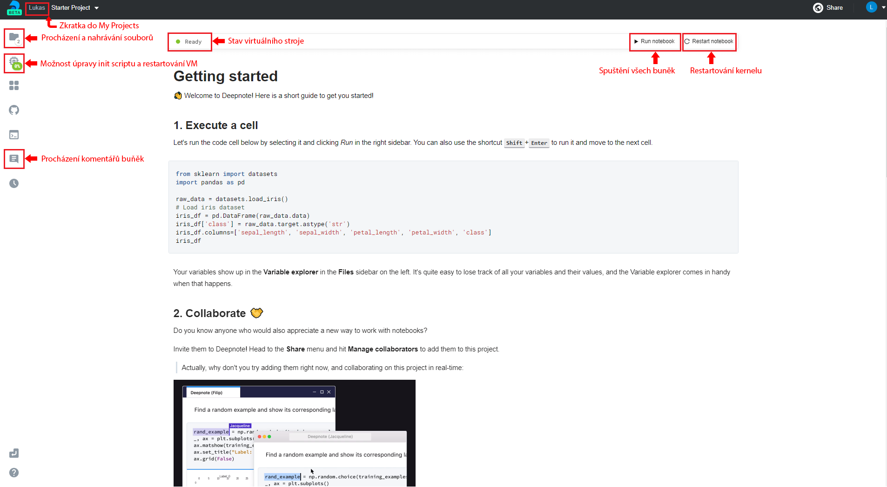
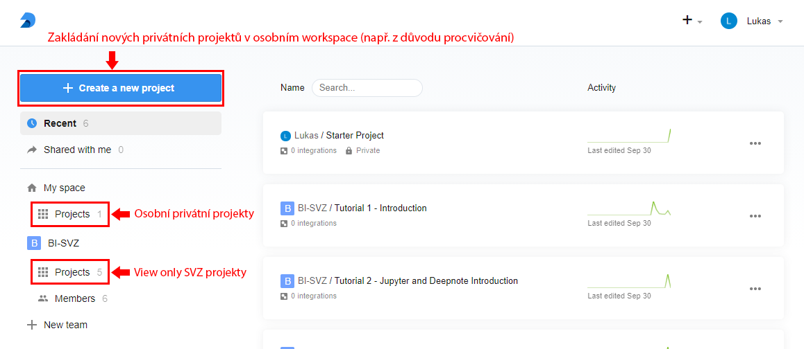
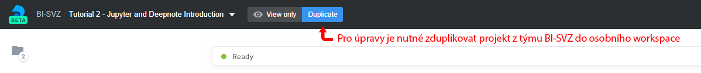
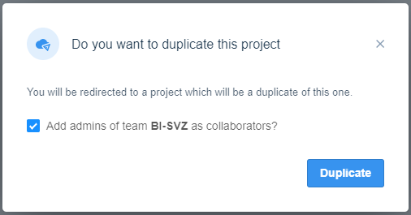

= Seznámení s Deepnote

Deepnote je online kolaborativní nástroj určený pro data mining. Umožňuje uživatelům spouštět Jupyter Notebooky v online prostředí na virtuálním stroji bez toho, aby si cokoliv instalovali na svůj lokální počítač. Hlavní výhodou pro náš kurz je, že není nutné rozcházet vlastní prostředí v Pythonu, které by vám zabíralo několik GB na disku. Zároveň se vyhneme i problémům s nekompatibilitami knihoven a operačních systémů, neboť vše vždy běží na identickém stroji, který po jeho spuštění instaluje všechny potřebné knihovny nanovo.

Deepnote je nyní stále ve fázi intenzivního vývoje. Může se tedy stát, že objevíte nějaký bug nebo se nějaká funkcionalita nebude chovat zcela korektně. Zároveň jsou na roadmapě další funkcionality, které nám pak usnadní práci na našich projektech a to verzování notebooků a code reviews.

== Registrace a přihlášení
Svou registraci proveďte pod https://deepnote.com/join-team?token=5ee2cb4e12414b5[tímto odkazem] a použijte přihlášení přes Google svým FIT účtem ve tvaru __username@fit.cvut.cz__.

Po úspěšném prvním přihlášení budete přesměrování do úvodního projektu **Starter Project**, který vás v krátkosti seznámí s prostředím Deepnote.

== Přehled projektů

Po prostudování informací v **Starter Projectu**, klikněte vpravo nahoře na ikonku svého profilu a přejděte do sekce **My Projects**. V této sekci vždy uvidíte projekty ve svém osobním workspace, ale zároveň budete mít přístup k projektům týmu BI-SVZ, kam budeme nahrávat všechny potřebné podklady pro tento kurz (cvičení a úkoly).

V sekci přehledu projektů můžete vytvořit svůj vlastní projekt, který je ve výchozím stavu privátní. Pokud byste jej chtěli s někým sdílet, tak je nutné jej otevřít a v horní liště vpravo využít tlačítko **Share**. Po dobu tohoto kurzu byste si však měli vystačit s již připravenými notebooky, které naleznete v týmu BI-SVZ.

== Práce na projektu

Všechny dostupné projekty v diskutovaném týmu BI-SVZ jsou pro studenty pouze s právy **View only**. Abyste mohli notebook spouštět a dělat do něj vlastní úpravy, je nejdříve nutné vytvořit jeho kopii. To lze učinit pomocí tlačítka *Duplicate* v horní liště, které jej nakopíruje do vašeho osobního workspace.

Abychom mohli k vašim úkolům přistupovat a hodnotit je, nezapomeňte před duplikováním zaškrtnout checkbox "**Add admins of team BI-SVZ as collaborators?**". Po potvrzení dojde k duplikaci do vašich projektů a zároveň k přesměrování už na editovatelný a spustitelný notebook. V případě, že cílový projekt obsahuje např. dataset nebo jiná velká data, může proces duplikace trvat i několik minut.

== Spuštění hardwaru

Jakmile dojde k úspěšnému duplikování cílového projektu, Deepnote začne automaticky spouštět virtuální stroj. Aktuální stav stroje je možné vidět v horním panelu vedle tlačítek *Run notebook* a **Restart notebook**. Cílem je, abyste v panelu před jakoukoliv interakcí s notebooky (např. spouštění buňek) viděli nápis *Ready* se zelenou ikonkou.

Občas se může stát, že se v notebooku něco zasekne, nefunguje apod. V případě, že jste si jisti, že nejde o vaší chybu, je možné restartovat kernel daného notebooku tlačítkem Restart notebook. Poté zkuste dané buňky opětovně spustit.

== Práce v noteboocích

Po nastartování a inciailizaci virtuálního stroje už můžete plně využívat dostupné prostředí. Do buněk můžete psát svůj vlastní Python kód, který můžete spouštět pomocí zkratky CTRL + ENTER (alternativně SHIFT + ENTER s přeskočením na další buňku) a výstupy vždy uvidíte po vykonání daného kódu hned pod buňkou. To, zda daná buňka již byla spuštěna a skončila bez chyby, poznáte tak, že je vlevo dole označena zeleným checkmarkem.

Pro efektivnější práci v notebooku se doporučuje využívat klávesové zkratky. Jejich seznam naleznete v nápovědě s ikonou vlevo dole.

== Instalace dodatečných knihoven

Pokud by se náhodou stalo, že připravený projekt neobsahuje knihovnu, kterou potřebujete nebo byste rádi využili, je možné tuto knihovnu ručně doinstalovat. Jedním ze způsobů je spustit příkaz
``!pip install __název-knihovny__`` v libovolné buňce notebooku. Elegantnější řešení je však úprava souboru **requirements.txt**, díky kterému jsou závislosti nainstalovány po každém spuštění virtuálního stroje daného projektu. Po úpravě tohoto souboru je tedy nutné restartovat virtuální stroj v záložce **Environment**.

== Troubleshooting
V této sekci je seznam nejčastějších problémů a jejich možné řešení. Před jakýmkoliv troubleshootingem se však doporučuje restartovat notebook nebo virtuální stroj, aby bylo možné jako první vyloučit rozbitý workspace. V případě, že body níže nevyřeší váš problém, nebojte se kontaktovat své cvičící.

=== ModuleNotFoundError: No module named 'XYZ'
Pro všechny projekty (domácí úkoly a cvičení) byste měli mít od cvičících připravený soubor **requirements.txt**, který pokrývá všechny potřebné závislost pro danou úlohu. Nemělo by se tedy stát, že vám bude nějaká knihovna chybět. Nejpravděpodobnější příčina tedy je, že jste spustili nějakou z buněk dříve, než stihl doběhnout inicializační skript **init.ipynb**, který je automaticky spuštěn po nastartování virtuálního stroje. Díky tomu se jednotlivé knihovny  nestihly stáhnout/nainstalovat a prostředí tak není v korektním stavu.

Chyba se také projevuje tím, že ve stavové liště máte místo stavu *Ready* stav **Initialization failed**. Řešením je restartovat virtuální stroj a počkat na doběhnutí init.ipynb skriptu.

V případě, že ani to nepomůže, můžete zkusit volitelně upravit soubor *requirements.txt* o chybějící knihovnu. Také na tuto chybu nezapoměnte upozornit cvičící.

=== FileNotFoundError: [Errno 2] No such file or directory: 'XYZ'
Tato chybová hláška znamená, že cesta k danému souboru XYZ neexistuje. Příčina a řešení tohoto problému může probíhat na dvou rovinách.

. Překlep v cestě k souboru. **Řešení**: Zkontrolovat cestu a opravit překlepy

. Z nějakého důvodu jste změnili aktuální složku, ve které notebook pracuje. To lze zjistit z výstupu magického příkazu ``%cd``.
**Řešení**: spustit příkaz ``%cd ~/work``, který workspace změní na korektní cestu ``/home/jovyan/work``

Tento problém může být také signalizován jinými chybovými hláškami např.:

* ``TypeError: Image data of dtype object cannot be converted to float``
* ``error: OpenCV(4.1.1) XYZ: error: (-215:Assertion failed) !_src.empty() in function ABC``

