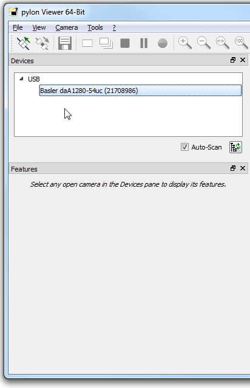

== Rozchození virtuálního prostředí pro práci v Pythonu s Jupyter Notebooky

V učebně máme nainstalovaný systém Windows, všechny popsané kroky se tedy budou týkat tohoto systému. Instalace a kroky na Linuxu však probíhájí obdobně. 

K naší práci budeme potřebovat několik balíčku, které je potřeba nainstalovat do virtuálního prostředí. Abychom nám usnadnily život, je možné při vytváření virtuálního prostředí specifikovat soubor _spec-file.txt_, který obsahuje seznam potřebných balíčků pro tento kurz (viz jednotlivé soubory pro různé operační systémy níže). Ty se následně nainstalují při vytváření virtuálního prostředí. 

Detaily ke správě prostředí lze nalézt https://conda.io/docs/user-guide/tasks/manage-environments.html[zde], detaily k instalaci balíčků https://conda.io/docs/user-guide/tasks/manage-pkgs.html[zde].

=== Postup na cvičení

* Zkontrolujte, zda je u vás na PC nainstalovaná Anaconda.
* Zapněte si `Anaconda Prompt`, ve kterém je možné využívat Python interpreter, instalovat balíčky a přepínat/modifikovat virtuální prostředí.
* Zkontrolujte, jaké u vás existují virtuální prostředí 
** `conda env list`
* Pokud v seznamu *NENÍ* prostředí SVZ:
** Přidejte cestu s vytvořeným virtuální prostředí do Anacondy. 
*** `conda config --append envs_dirs D:\env`
* Vyzkoušejte:
** `conda activate SVZ`
* Pokud stále něco nepůjde, kontaktujte učitele :)

=== Postup doma

* Zkontrolujte, zda je u vás na PC nainstalovaná Anaconda. Jinak si ji https://www.anaconda.com/download[stáhněte] a nainstalujte (vždy nejnovější verzi pro Python 3.7).
* Zapněte si `Anaconda Prompt`, ve kterém je možné využívat Python interpreter, instalovat balíčky a přepínat/modifikovat virtuální prostředí.

* Zvolte správný spec-file pro váš operační systém
** Windows 10 (x64): link:env/SVZ-spec-file-win64.txt[SVZ-spec-file-win64]
** Linux Ubuntu (x64): link:env/SVZ-spec-file-linux-ubuntu.txt[SVZ-spec-file-linux-ubuntu]
** macOS (x64): link:env/SVZ-spec-file-darwin.txt[SVZ-spec-file-darwin]
* Vytvořte prostředí SVZ pomocí spec-file  takto:
** `conda create --name SVZ --file <cesta k SVZ-spec-file-XXX.txt>`
* Aktivujte vytvořené virtuální prostředí
** `activate SVZ`
* Doinstalujte potřebné knihovny pipem pomocí link:env/SVZ-pip-req.txt[SVZ-pip-req] takto:
** `pip install -r <cesta k SVZ-pip-req.txt>`

=== Důležité

* Před každým cvičením/úkolem je nutné zkontrolovat zda nepracujete ve výchozím prostředí (base). Přepnutí do prostředí SVZ:
** `conda activate SVZ`
* S aktivovaným prostředím spusťte Jupyter notebook ve složce se soubory ke kurzu
** `jupyter notebook <cesta k souborum kurzu>` 
* Otevřete úvodní notebook link:files/1/python-introduction.ipynb[Seznámení s jazykem Python] a zkontrolujte, zda všechny úvodní importy proběhnou bez problémů. 
** Pokud uvidíte hlášky typu `ImportError: No module named cv2`, musí se daný balíček doinstalovat pomocí `conda install`. V tom případě kontaktujte učitele.

==== Poznámky

Výpis všech virtuálních prostředí lze provést pomocí `conda env list`, výpis balíčku v aktuálním prostředí `conda list`. Deaktivace aktuálního prostředí pomocí `conda deactivate`.  V případě, že chcete nějaké prostředí odstranit, tak `conda env remove --name <nazev>`. Dobrým zvykem je neinstalovat balíčky globálně (do výchozího base prostředí), ale pro každý projekt vytvořit nové virtuální prostředí. Další detaily ke správě prostředí lze nalézt https://conda.io/docs/user-guide/tasks/manage-environments.html[zde].

==== Tvorba nového virtuálního prostředí (pro admina) 

* Stáhnout soubor link:env/SVZ-spec-file-win64.txt[SVZ-spec-file-win64] a vytvořit virtuální prostředí s balíčky nutnými pro tento kurz. 
* Virtuální prostředí se vytváří na disku D:
** `conda create --prefix D:\env\SVZ --file <cesta k spec-file.txt>`

== Přípojení a správa kamer v Pylonu 

Pylon Viewer je software, SDK a zároveň i soubor ovladačů pro připojení a práci s průmyslovými kamerami Basler. Oficiální manuál je k dispozici https://docs.baslerweb.com/pylon-camera-software-suite[ZDE]. 

=== Základ

Základem je najít tu správnou kameru v menu dostupných. Vzhledem k tomu, že všechny GigE kamery jsou připojeny na stejný switch, má každé pracoviště dostupné všechny kamery. 

*DŮLEŽITÉ*: Ve chvíli, kdy je některá kamera otevřena v jakémkoli softwaru na jakémkoli počítači, je v tu chvíli zamknuta k danému softwaru. Nelze se k ní již připojit z jiného softwaru. Proto je vždy třeba vědět, jaké je sériové číslo kamery, která je dostupná pro vaše pracoviště a k té se připojovat.

Sériové číslo kamery je napsáno přímo na kameře (první obrázek) nebo přímo na krabici kamery (druhý obrázek).

image:images/kam_SN.png[]

image:images/krab_SN.png[]

Pro jednodušší vyhledání kamery lze kameře v Pylonu nastavit tzv. Device User ID. Jedná se o neunikátní identifikátor, který se bude v Pylonu zobrazovat jako název kamery před jejím sériovým číslem (v závorce). Pro projevení změny po nastavení je potřeba software Pylon vypnout a zapnout.

image:images/device_user_id.png[]

=== Několik užitečných odkazů

* https://docs.baslerweb.com/overview-of-the-pylon-viewer.html[Přehled softwaru Pylon]
** Obsahuje popis všech ikon z menu a hlavně z toolbaru.
* https://docs.baslerweb.com/opening-and-closing-a-device.html[Připojení kamery]
** Prakticky se jedná pouze o klik na požadovanou ikonu z toolbaru.
* https://docs.baslerweb.com/configuring-a-camera.html[Základní konfigurace kamery]
** Ukazuje rychlý postup, jak nastavit pár základních parametrů kamery, jakými jsou Zisk (Gain) nebo Expoziční čas (Exposure Time).

=== Nastavení parametrů kamery
Názvy často hledaných parametrů jsou:

* Gain, Gain Auto
* Exposure Time, Exposure Auto
* Pixel Format
* Width, Height, X Offset, Y Offset
* Binning Horizontal, Binning Vertical
** pouze pro černobílé kamery!
* Acquisition Frame Rate, Enable Acquisition Frame Rate

Nejjednodušší způsob je využít pole hledání. 

